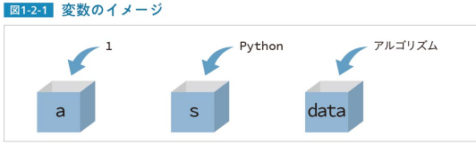
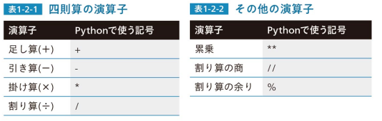
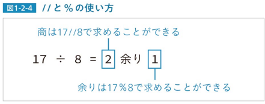
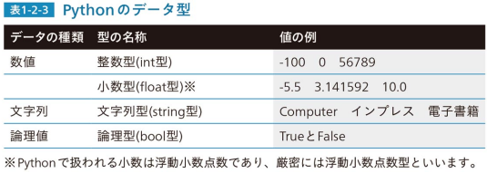

# Lesson1-1 入力と出力

## print()命令を使う

### print_1.py
```
print("プログラミングを始める") # print()命令で文字列を出力する
```

##### 実行結果
```
プログラミングを始める
```
## 変数の値を出力する

### print_2.py
```
a = 2024 # aという名の変数を2024という値を代入
print(a) # aの値を出力する
```

##### 実行結果
```
2024
```

### print_3.py
```
a = 1000 # aという変数に1000という値を代入
print("aの値は", a , "である。") # 文字列と変数の値を出力する
```

##### 実行結果
```
aの値は 1000 である。
```

## input()命令を使う

### input_1.py
```
s = input("文字列の入力:") # input()命令で入力した文字列を変数sに代入
print("あなたが入力した文字列→" + s) # 文字列を「+」でつなぎ、出力する
```

##### 実行結果
```
文字列の入力:test
あなたが入力した文字列→test
```

#### Lesson1-1のポイント
- print()命令で、文字列や変数の値を出力する
- input()命令で、文字列の入力を受け付け、その文字列を変数に代入する

# Lesson1-2 変数

## 変数とは
変数とはコンピュータのメモリ上に用意された、データを入れる箱のようなものである。<br />
変数をイメージで表したものが次の図である。<br />


この図はaという名の変数に1という数値を、sという変数にPythonという文字列を、dataという変数にアルゴリズムという文字列を入れる様子を表す。次のプログラムはこの図を記述したものである。

### variable_1.py
```
a = 1 # 変数をaに1という数値を代入
s = "Python" # 変数sにPythonという文字列を代入
data = "アルゴリズム" # 変数dataにアルゴリズムという文字列を代入
print(a, s, data) # print()命令でa、s、dataの中身を出力
```

##### 実行結果
```
1 Python アルゴリズム
```

## 変数の宣言
変数はプログラムを組む人が名前を決めて用意する。変数名はアルファベット、数字、アンダースコア(_)を組み合わせて付けることができる。<br />
Pythonの変数は、イコール(=)を用いて最初に代入する値(初期値)を記述した時点から使えるようになる。これを**変数の宣言**といい、値を代入するイコール(=)を代入演算子という。<br />
C/C++やJavaなどのプログラミング言語では、変数を使う前に型(intやStringなど)を指定するが、Pythonでは型指定を行わない。

## 変数の値を変更する
変数の値はいつでも入れなおすことができる。変数名=の後に計算式を記述し、変数の値を変更することもできる。<br />
以下のプログラムでは、変数の宣言時に入れた初期値を別の値に変更するプログラムを確認する。

### variable_2.py
```
n = 0 # nという変数を宣言し、初期値を代入
print("nの初期値は", n) # nの値を代入
n = 20 # nに新たな値を代入
print("新たな値", n , "を代入") # nの値を出力
n = n + 80 # nの値を80を足し、nに代入
print("nに80を足すと", n , "になる") # nの値を出力
n = n - 100 # nの値から100を引き、nに代入
print("nから100を引くと", n , "になる") # nの値を出力
```

1行目で変数nを宣言し、初期値を代入して、2行目でその値を出力している。<br />
3行目でnに新たな値を代入し、4行目でその値を出力している。<br />
5行目ではnの値に80を足したものを再びnに代入し、6行目でその値を出力している。<br />
7行目ではnの値から100を引いたものを再びnに代入し、8行目でその値を出力している。

##### 実行結果
```
nの初期値は 0
新たな値 20 を代入
nに80を足すと 100 になる
nから100を引くと 0 になる
```

## 演算子について
足し算を行う+と、引き算を行う-の記号を用いている。計算に使う記号を**演算子**といい、掛け算は*(アスタリスク)、割り算は/(スラッシュ)で記述する。<br />
その他、累乗を求める演算子、割り算の商を求める演算子、割り算の余り(剰余)を求める演算子がある。





## 変数の付け方
変数名の付け方のルールを説明する。×印はつけてはいけない例である。
1. アルファベットとアンダースコア(_)を組み合わせ、任意の名称にできる
   - 例：〇new_data = 5、〇my_id = 1
2. 数字を含めることができるが、数字から始めてはいけない
   - 例：〇data1 = 10、×1data = 10
3. 予約後は使用してはいけない
   - 例：×if = 0、×for = 100
   - **予約語**とは、コンピュータに基本的な処理を命じるための語である。Pythonにはif、elif、else、and、or、for、while、import、defなどの予約語がある。

## データ型について
変数の**データ型**を単に型ということもある。Pythonには以下の図のようなデータ型がある。



## 文字列と数値の変換
**int()** と**float()** という命令で、文字列を数値に変換できる。int()は文字列や少数を整数にし、float()は文字列や整数を少数にする。<br />
以下のプログラムが例である。

### variable_3.py
```
s = "10000" # 変数sに文字列10000を代入
print(s + s) # sの値とsの値を+でつないで出力
i = int(s) # 変数iにsの値を整数に変換して代入
print(i + i) # iの値とiの値を+で足して出力
```

##### 実行結果
```
1000010000
20000
```

## 数値を文字列に変換する
**str()** は整数を文字列に変換する命令である。以下のプログラムが例である。

### variable_4.py
```
f = 3.14 # 変数fを宣言し、小数値を代入
s = "πの値は" + str(f) # 「πの値は」と、文字列にしたfの値をつなぎ、sに代入
print(s) # sの値を出力
```

##### 実行結果
```
πの値は3.14
```
「πの値は」という文字列と、3.14という数値をつなぐために、2行目のようにstr()命令を用いている。<br />
これを「s = "πの値は" + f」と記述するとエラーになる。

#### Lesson1-2のポイント
- 変数を使うには「変数名 = 初期値」と記述する
- 計算に使う記号を演算子といい、+-*/と**、//、%がある
- 変数のデータ型には、整数型、小数型、文字列型、論理型がある

# Lesson1-3 条件分岐

## 条件分岐を理解する

