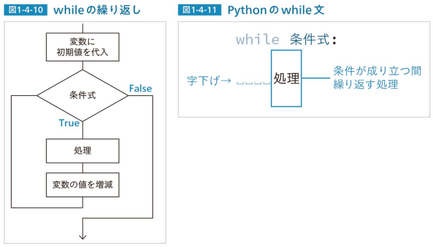

# Chapter1 プログラミングの基礎知識

# Lesson1-1 入力と出力

## print()命令を使う

### print_1.py
```
print("プログラミングを始める") # print()命令で文字列を出力する
```

##### 実行結果
```
プログラミングを始める
```
## 変数の値を出力する

### print_2.py
```
a = 2024 # aという名の変数を2024という値を代入
print(a) # aの値を出力する
```

##### 実行結果
```
2024
```

### print_3.py
```
a = 1000 # aという変数に1000という値を代入
print("aの値は", a , "である。") # 文字列と変数の値を出力する
```

##### 実行結果
```
aの値は 1000 である。
```

## input()命令を使う

### input_1.py
```
s = input("文字列の入力:") # input()命令で入力した文字列を変数sに代入
print("あなたが入力した文字列→" + s) # 文字列を「+」でつなぎ、出力する
```

##### 実行結果
```
文字列の入力:test
あなたが入力した文字列→test
```

#### Lesson1-1のポイント
- print()命令で、文字列や変数の値を出力する
- input()命令で、文字列の入力を受け付け、その文字列を変数に代入する

# Lesson1-2 変数

## 変数とは
変数とはコンピュータのメモリ上に用意された、データを入れる箱のようなものである。<br />
変数をイメージで表したものが次の図である。<br />


この図はaという名の変数に1という数値を、sという変数にPythonという文字列を、dataという変数にアルゴリズムという文字列を入れる様子を表す。次のプログラムはこの図を記述したものである。

### variable_1.py
```
a = 1 # 変数をaに1という数値を代入
s = "Python" # 変数sにPythonという文字列を代入
data = "アルゴリズム" # 変数dataにアルゴリズムという文字列を代入
print(a, s, data) # print()命令でa、s、dataの中身を出力
```

##### 実行結果
```
1 Python アルゴリズム
```

## 変数の宣言
変数はプログラムを組む人が名前を決めて用意する。変数名はアルファベット、数字、アンダースコア(_)を組み合わせて付けることができる。<br />
Pythonの変数は、イコール(=)を用いて最初に代入する値(初期値)を記述した時点から使えるようになる。これを**変数の宣言**といい、値を代入するイコール(=)を代入演算子という。<br />
C/C++やJavaなどのプログラミング言語では、変数を使う前に型(intやStringなど)を指定するが、Pythonでは型指定を行わない。

## 変数の値を変更する
変数の値はいつでも入れなおすことができる。変数名=の後に計算式を記述し、変数の値を変更することもできる。<br />
以下のプログラムでは、変数の宣言時に入れた初期値を別の値に変更するプログラムを確認する。

### variable_2.py
```
n = 0 # nという変数を宣言し、初期値を代入
print("nの初期値は", n) # nの値を代入
n = 20 # nに新たな値を代入
print("新たな値", n , "を代入") # nの値を出力
n = n + 80 # nの値を80を足し、nに代入
print("nに80を足すと", n , "になる") # nの値を出力
n = n - 100 # nの値から100を引き、nに代入
print("nから100を引くと", n , "になる") # nの値を出力
```

1行目で変数nを宣言し、初期値を代入して、2行目でその値を出力している。<br />
3行目でnに新たな値を代入し、4行目でその値を出力している。<br />
5行目ではnの値に80を足したものを再びnに代入し、6行目でその値を出力している。<br />
7行目ではnの値から100を引いたものを再びnに代入し、8行目でその値を出力している。

##### 実行結果
```
nの初期値は 0
新たな値 20 を代入
nに80を足すと 100 になる
nから100を引くと 0 になる
```

## 演算子について
足し算を行う+と、引き算を行う-の記号を用いている。計算に使う記号を**演算子**といい、掛け算は*(アスタリスク)、割り算は/(スラッシュ)で記述する。<br />
その他、累乗を求める演算子、割り算の商を求める演算子、割り算の余り(剰余)を求める演算子がある。


## 変数の付け方
変数名の付け方のルールを説明する。×印はつけてはいけない例である。
1. アルファベットとアンダースコア(_)を組み合わせ、任意の名称にできる
   - 例：〇new_data = 5、〇my_id = 1
2. 数字を含めることができるが、数字から始めてはいけない
   - 例：〇data1 = 10、×1data = 10
3. 予約後は使用してはいけない
   - 例：×if = 0、×for = 100
   - **予約語**とは、コンピュータに基本的な処理を命じるための語である。Pythonにはif、elif、else、and、or、for、while、import、defなどの予約語がある。

## データ型について
変数の**データ型**を単に型ということもある。Pythonには以下の図のようなデータ型がある。


## 文字列と数値の変換
**int()** と**float()** という命令で、文字列を数値に変換できる。int()は文字列や少数を整数にし、float()は文字列や整数を少数にする。<br />
以下のプログラムが例である。

### variable_3.py
```
s = "10000" # 変数sに文字列10000を代入
print(s + s) # sの値とsの値を+でつないで出力
i = int(s) # 変数iにsの値を整数に変換して代入
print(i + i) # iの値とiの値を+で足して出力
```

##### 実行結果
```
1000010000
20000
```

## 数値を文字列に変換する
**str()** は整数を文字列に変換する命令である。以下のプログラムが例である。

### variable_4.py
```
f = 3.14 # 変数fを宣言し、小数値を代入
s = "πの値は" + str(f) # 「πの値は」と、文字列にしたfの値をつなぎ、sに代入
print(s) # sの値を出力
```

##### 実行結果
```
πの値は3.14
```
「πの値は」という文字列と、3.14という数値をつなぐために、2行目のようにstr()命令を用いている。<br />
これを「s = "πの値は" + f」と記述するとエラーになる。

#### Lesson1-2のポイント
- 変数を使うには「変数名 = 初期値」と記述する
- 計算に使う記号を演算子といい、+-*/と**、//、%がある
- 変数のデータ型には、整数型、小数型、文字列型、論理型がある

# Lesson1-3 条件分岐

## 条件分岐を理解する

条件分岐を言葉で表すと、「ある条件が成立したら、この処理をしなさい」となる。<br />
条件が成立したかを調べる式を**条件式**という。条件分岐の処理の流れを以下の図になる。


## if文の書式
Pythonでは**if**という命令で条件分岐を記述する。ifを用いて記した処理をif文という。<br />
if文は次の図に記述する。


Pythonでは、条件成立時に行う処理を**字下げ(インデント)**として記述する。Pythonの字下げは通常、半角スペース4文字分とする。<br />
字下げした部分が、**ブロック**と呼ばれる「処理のまとまり」になる。Pythonには字下げでブロックを構成する決まりがある。条件成立時の処理を複数の行で記述するなら、それらの行を全て字下げして1つのブロックとする。<br />
if文で記述したプログラムを以下で確認する。

### if_1.py
```
n = -1 # 変数nに-1を代入
if n == 0: # nが0なら
    print("nはゼロである。") # 「nはゼロである。」と出力
if n > 0: # nが0より大きいなら
    print("nは正の数である。") # 「nは正の数である。」と出力
if n < 0: # nが0より小さいなら
    print("nは負の数である。") # 「nは負の数である。」と出力
```

##### 実行結果
```
nは負の数である。
```

## 条件式について
条件式については以下の図で示した書式で記述する。


## if~else
**if~else**を用いて、条件式が成り立たなかった時の処理を記述できる。<br />
以下の図がif~elseのフローである。


if~elseを用いたプログラムを以下で確認する。

### if_2.py
```
n = -0.5 # 変数nに-0.5を代入
if n >= 0: # nの値が0以上なら
    print("nは0以上の値である。") # 「nは0以上の値である。」と出力
else: # そうでなければ
    print("nは0未満の値である。") # 「nは0未満の値である。」と出力
```

##### 実行結果
```
nは0未満の値である。
```

## if~elif~else
**if~elif~else**という記述で、複数の条件を順に調べることができる。<br />
以下の図がif~elif~elseのフローである。


if~elif~elseを用いたプログラムを以下で確認する。

### if_3.py
```
n = 100 # nに100を代入
if n == 0: # nが0なら
    print("nはゼロである。") # 「nはゼロです」と出力
elif n > 0: # そうでなく0より大きいなら
    print("nは正の数である。") # 「nは正の数である。」と出力
else: # いずれの条件も成り立たないなら
    print("nは負の数である。") # 「nは負の数である。」と出力
```

##### 実行結果
```
nは正の数である。
```

## andとor
**and**や**or**を用いて、if文に複数の条件式を記述することができる。andは「かつ」、orは「もしくは」の意味である。<br />
以下はandとorを用いた図である。


andとorを用いたプログラムを順に以下で確認する。

### if_and.py
```
m = 1 # mに1を代入
n = 2 # nに2を代入
if m > 0 and n > 0: # mが0より大きく、かつ、nが0より大きいなら
    print("m、nともに正の値である。") # 「m、nともに正の値である。」と出力
```

##### 実行結果
```
m、nともに正の値である。
```

### if_or.py
```
x = 0 # xに0を代入
y = 10 # yに10を代入
if x == 0 or y == 0: # xが0もしくはyが0なら
    print("xとyのどちらかは0である。") # 「xとyのどちらかは0である。」と出力
```

##### 実行結果
```
xとyのどちらかは0である。
```

#### Lesson1-3のポイント
- if~elif~elseで条件分岐を記述する
- 条件が成り立つか調べる式を条件式という
- andやorを用いて、if文に複数の条件式を記述できる

# Lesson1-4 繰り返し

繰り返しとは、コンピュータに、一定回数、反復して処理を行わせることである。<br />
アルゴリズムのプログラムでは、繰り返しの命令を用いて何度も計算を行い、解を求めることが、しばしば行われる。<br />
Pythonでは繰り返しを**for**や**while**という命令で記述する。プログラムでの繰り返しを言葉で表すと、次のようになる。

1. 「変数の値をある範囲で変化させ、その間、処理を繰り返す」
2. 「ある条件が成り立つ間、処理を繰り返す」
3. 「1.」の繰り返しはfor、「2.」の繰り返しはwhileで記述する。

## for文について
forを用いて記述した繰り返しをfor文という。for文の処理の流れは、以下の図のようになる。


## for文の書式
for文は次のように記述する。


## range()命令で範囲を指定する
Pythonでは**range()**命令で変数の値の範囲を指定する。range()には以下の表に示した書き方がある。

.png)

## forを用いたプログラム
for文の動作を確認する。繰り返しに使う変数名は慣例的にiとすることが多く、以下のプログラムでもiを用いている。<br />
まず繰り返す回数を指定する記述とその動作を確認する。

### for_1.py
```
for i in range(10): # 繰り返しiは0から始まり10回繰り返す
    print(i) # iの値を出力
```

##### 実行結果
```
0
1
2
3
4
5
6
7
8
9
```

### for_2.py
```
for i in range(1, 5): # 繰り返しiは1から始まり、4まで1ずつ増える
    print(i) # iの値の出力
```

##### 実行結果
```
1
2
3
4
```

### for_3.py
```
for i in range(20, 10, -1): # 繰り返しiは20から始まり、11まで1ずつ減る
    print(i) # iの値を出力
```

##### 実行結果
```
20
19
18
17
16
15
14
13
12
11
```

## forの多重ループ
for文中に別のfor文を入れることが可能である。これをforの**二重ループ**という。<br />
for文中にfor文を記述することをforを入れ子にする、あるいは**ネスト**すると表現する。for文内にさらに別のfor文を入れることができ、それらをまとめてforの**多重ループ**という。<br />
多重ループを用いると高度な繰り返し処理ができる。次のプログラムの動作を確認しながら、多重ループを理解する。

### for_4.py
```
for y in range(3): # 繰り返しyは0から始まり、3回繰り返す
    print("yの値", y) # yの値を出力
    for x in range(4): # 繰り返しxは0から始まり、4回繰り返す
        print("    xの値", x) # xの値を出力
```

##### 実行結果
```
yの値 0
  xの値 0
  xの値 1
  xの値 2
  xの値 3
yの値 1
  xの値 0
  xの値 1
  xの値 2
  xの値 3
yの値 2
  xの値 0
  xの値 1
  xの値 2
  xの値 3
```

外側のfor文はyの値が0から始まる。yが0の時、変数xを用いた内側のfor文で、xの値は0から3まで1ずつ増えていく。xの繰り返しが終わると、yの値が1になり、再びxの繰り返しが行われる。こうしてyの値が2、xの値が3になるまで処理が繰り返される。

## breakとcontinue
breakとcontinueという命令について説明する。**break**とは繰り返しを中断する命令、**continue**は繰り返しの先頭に戻る命令である。breakとcontinueはifと組み合わせて使う。<br />

### for_break.py
```
for i in range(10): # 繰り返し1は0から始まり、10回繰り返す
    print(i) # iの値を出力
    if i == 3: # iの値が3であれば
        break # breakで繰り返しを抜ける
```

##### 実行結果
```
0
1
2
3
```

### for_continue.py
```
for i in range(10): # 繰り返しiは0から始まり、10回繰り返す
    if i < 5: # iの値が5未満であれば
        continue # continueで繰り返しの先頭に戻る
    print(i) # iの値を出力
```

##### 実行結果
```
5
6
7
8
9
```

## whileで繰り返す
whileによる繰り返しの処理の流れを図示すると以下の図のようになる。



whileの繰り返しに用いる変数は、whileの前で宣言する。次のプログラムでwhile文の動作を確認する。

### while_1.py
```
i = 1 # 繰り返しに使う変数iに初期値1を代入
while i <= 256: # whileの条件式をi<=256とし、繰り返す
    print(i) # iの値を出力
    i *= 2 # iの値を2倍し、iに代入
```

##### 実行結果
```
1
2
4
8
16
32
64
128
256
```

## while Trueの繰り返し
**while True**と記述すると、常に条件式が成り立ち、処理が延々と繰り返される。<br />
while Trueの動作を次のプログラムで確認する。

### while_2.py
```
while True: # whileの条件式をTrueとし、無限に繰り返す
    s = input("文字列を入力してください：") # 入力した文字列を変数sに代入
    print(s) # sの値を出力
    if s == "": # 何も入力しなかったなら
        break # 繰り返しを抜ける

```

##### 実行結果
```
文字列を入力してください：アルゴリズム
アルゴリズム
文字列を入力してください：Python
Python
文字列を入力してください：
```

このプログラムは、入力した文字列をそのまま出力することを、延々と繰り返す。
何も入力せずに「Enter(return)」キーを押すと、4~5行目のifとbreakで繰り返しを抜け、処理が終了する。<br />
プログラムの記述ミスなどで処理が延々と続いてしまう時は、「Ctrl + C」キーでそのプログラムを強制終了できる。このプログラムを再度、実行し、「Ctrl + C」キーによる中断を確認する。そして万が一のために、この中断方法を覚えておくとよい。

#### Lesson1-4のポイント
- 繰り返しの命令にはforとwhileがある
- for文には、繰り返しに使う変数名を記述し、その値の範囲をrange()で指定する
- while文には、繰り返しを続ける条件式を記述する
- breakで繰り返しを中断し、continueで繰り返しの先頭に戻る

# Lesson1-5 関数

関数とはコンピュータが行う処理を1つのまとまりとして記述したものである。何度も行う処理があれば、それを関数として定義することで、無駄がなく、不具合の起きにくいプログラムを組むことができる。

## 関数のイメージ
**関数**には**引数**でデータを与え、関数内でそのデータを加工し、**戻り値**として加工した値を返す機能を持たせることができる。そのイメージが以下の図である。


引数と戻り値は必須なものではないが、以下の図に示した通り、引数も戻り値もない関数(➀)、引数はあるが戻り値はない関数(➁)、引数はないが戻り値はある関数(➂)、引数も戻り値もある関数(➃)と4つに定義できる。<br />
このうち、➀➁➃の定義方法について、実際にプログラムに例示しながら説明していく。➂は➀や➃を理解すれば定義できるので、プログラムの例は省略する。


## 関数の書式
Pythonではdefで関数を定義する。以下の図に書式を示す。


## ➀引数、戻り値、ともにない関数
まずは引数も戻り値もない、簡素な関数を記述したプログラムで、関数の動作を確認する。

### function_1.py
```
def hi(): # hi()という関数を定義する
    print("こんにちは！！") # print()命令で文字列を出力
hi() # hi()関数を呼び出す（実行する）
```

##### 実行結果
```
こんにちは！！
```

## ➁引数あり、戻り値なしの関数
次は、引数あり、戻り値なしの関数を確認する。

### function_2.py
```
def posi_naga_zero(val): # posi_naga_zero()という関数を定義する
    if val > 0: # 引数valの値が0より大きいなら
        print(val, "は正の数である。") #「valは正の数である。」と出力
    elif val < 0: # そうでなく、valは0より小さいなら
        print(val, "は負の数である。") #「valは負の数である。」と出力
    else: # いずれでもなければ
        print(val, "はゼロである。") #「valはゼロである。」と出力

posi_naga_zero(-5) # 引数を与えて関数を呼び出す
posi_naga_zero(0.8) # 引数を与えて関数を呼び出す
posi_naga_zero(0) # 引数を与えて関数を呼び出す
```

##### 実行結果
```
-5 は負の数である。
0.8 は正の数である。
0 はゼロである。
```

### ➃引数あり、戻り値ありの関数
関数に戻り値を持たせるには、関数内のブロックに「return 戻り値」と記述する。通常、戻り値は変数名か計算式を記述し、その変数の値や計算結果を返すようにする。<br />
次の図のような球体の体積を、戻り値で返す関数を定義する。球体の半径rの値を引数で与えると、体積を返す関数の例が以下の図である。


### function_3.py
```
def volume_sphere(r): # volume_sphere()という関数を定義する
    v = 4 * 3.14 * r**3 / 3 # 引数rの値から球の体積を計算しvに代入
    return v # vの値を返す

vs = volume_sphere(10) # 関数で計算した半径10の球の体積をvsに代入

print("半径10cmの球の体積は", vs, "cm3") # print()で球の体積を出力
print("半径20cmの球の体積は", volume_sphere(20), "cm3") # print()の引数にvolume_sphere()を記述し、半径20の球の体積を出力
```

##### 実行結果
```
半径10cmの球の体積は 4186.666666666667 cm3
半径20cmの球の体積は 33493.333333333336 cm3
```

## 変数の有効範囲について
変数は大きく、グローバル変数とローカル変数に分かれている。

- **グローバル変数** → 関数の外側で宣言した変数
- **ローカル変数** → 関数の内部で宣言した変数

それぞれの変数は有効範囲（その変数を扱える範囲）が違う。変数の有効範囲を**スコープ**という。グローバル変数とローカル変数のスコープは以下の図になる。<br />
グローバル変数は、それを宣言したプログラム内のどの位置でも使うことができるが、ローカル変数は、それを宣言した関数内でのみ使うことができる。<br />
またifやforのブロック内で宣言した変数（それらもローカル変数）は、そのブロック内でのみ使うことができる。変数はそれを宣言したブロック内で使える。


## global宣言
Pythonには、グローバル変数の値を関数内で変更する場合、その関数内でglobal宣言する決まりがある。この決まりは重要なものなので覚えておく。<br />
変数のスコープを理解することが大切である。次のプログラムでスコープを理解する。1行目のtotalという変数がグローバル変数で、4行目のloopsがローカル変数である。

### global_local.py
```
total = 0 # totalという変数を宣言し初期値0を代入
def test_func(): # test_func()という関数を定義する
    global total # totalをグローバル変数として扱うと宣言
    loops = 20 # loopsという変数に20を代入
    for i in range(loops): # for文でloops回、繰り返す
        total += 10 # totalの値に10足し、totalに代入

print("totalの初期値", total) # totalの初期値を出力
test_func() # test_func()を呼び出す
print("関数実行後のtotalの値", total) # 関数実行後のtotalの値を出力
```

##### 実行結果
```
totalの初期値 0
関数実行後のtotalの値 200
```

#### Lesson1-5のポイント
- コンピュータが行う処理を、1つのまとまりとして記述したものが関数である
- Pythonの関数はdefで定義する
- 関数には引数と戻り値を持たせることができる
- 変数はグローバル変数とローカル変数で有効範囲（スコープ）が違う

# Lesson1-6 配列

**配列**とは、複数のデータをまとめて管理するために用いる、番号を付けた変数のことである。Pythonにはリストというデータ構造が用意されており、それが配列に相当する。

## 配列とは
変数に番号を付けてデータを管理するものが配列である。配列をイメージで表すと次の図のようになる。<br />
この図ではaという名の箱がn個ある。このaが配列である。a[0]からa[n-1]の箱の1つ1つを**要素**という。<br />
そして箱がいくつあるかを**要素数**という。例えば10個の箱があれば、その配列数は10である。<br />
箱を管理する番号を**添え字(インデックス)**という。添え字は0から始まり、箱がn個あるなら、最後の添え字はn-1になる。


## 配列の宣言
配列は以下の図のように記述して宣言し、初期値を代入する。


## 配列でデータを扱う
複数の文字列と数値を配列で扱うプログラムを確認する。次のプログラムにはsubjectとscoreという2つの配列が記されている。配列名の付け方のルールは、変数名の付け方と同じである。

### array_1.py
```
subject = ["国語", "数学", "英語", "理科", "社会"] # subjectという配列を宣言し、文字列を代入
score = [80, 100, 92, 96, 74] # scoreという配列を宣言し、数値を代入
total = 0 # totalという変数に0を代入

for i in range(5): # 繰り返しiは0から4まで5回繰り返す
    print(subject[i], "の点数は", score[i]) # subject、scoreの各要素の値を出力
    total += score[i] # totalにscore[i]の値を加える

print("合計点は", total) # 計算した合計点を出力
```

##### 実行結果
```
国語 の点数は 80
数学 の点数は 100
英語 の点数は 92
理科 の点数は 96
社会 の点数は 74
合計点は 442
```

## 二次元配列
**二次元配列**は、縦方向と横方向に添え字を用いてデータを管理する配列である。縦方向をy、横方向をxとすると、各要素の添え字は以下の図のようになる。<br />
この時、データの横の並びを**行**、縦の並びを**列**と呼ぶ。


## 二次元配列の宣言
Pythonでは二次元配列を以下の図のように記述して宣言し、データの初期値を代入する。


## 二次元配列を用いたプログラム
以下のプログラムで二次元配列を確認する。

### array_2.py
```
data = [ # dataという名の二次元配列に初期値を代入
    [10, 20, 30, 40, 50], # 1行目の初期値
    [-1, -2, -3, -4, -5], # 2行目の初期値
    [55, 66, 77, 88, 99]  # 3行目の初期値
]

print(data[0][0]) # data[0][0]の値を出力
print(data[1][2]) # data[1][2]の値を出力
print(data[2][4]) # data[2][4]の値を出力
```

##### 実行結果
```
10
-3
99
```

#### Lesson1-6のポイント
- 複数のデータを扱うために用いる、番号を付けた箱を配列という
- 二次元配列は、2つの添え字で配列名[行][列]と記述する
- 配列と繰り返しでデータを扱うと、効率の良い処理ができる

# Extra Lesson 1-1 乱数を扱う
乱数はプログラマーにとって扱う機会が多い。例えば、確立や分布図の学習、乱数を用いた計算で解の近似値を求めたりシミュレーションを行うモンテカル法、ゲームソフトの開発など、広い分野で乱数が用いられる。

## モジュールについて
乱数を発生させるにはrandomモジュールを用いる。まず**モジュール**について簡単に説明する。Pythonには様々なモジュールが用意されており、それらを利用することで、より高度な処理がかのうになる。<br />
モジュールの例を以下の表に挙げる。


## randomモジュールの使い方
モジュールは必要に応じてimportして使用する。乱数を発生させるにはrandomモジュールをインポートする。<br />
以下のプログラムは1から6のいずれかの数を10回出力するプログラムである。このプログラムの動作を確認後に乱数を発生させる命令を説明する。<br />

このプログラムはrandomモジュールのrandint()関数で乱数を発生させている。モジュールを用いるには、1行目のように「**import モジュール名**」と記述する。<br />
そして4行目のように「**モジュール名.そのモジュールに備わった関数名**」と記述し、必要な命令を実行する。

### random_1.py
```
import random # randomモジュールをインポート

for i in range(10): # 繰り返し10回繰り返す
    r = random.randint(1, 10) # 変数rに1から6の乱数を代入
    print(r) # その値を出力
```

##### 実行結果
```
9
6
9
3
9
2
7
9
1
4
```

## 乱数を発生させる命令
乱数を発生させる命令の記述例を以下の表にまとめる。

